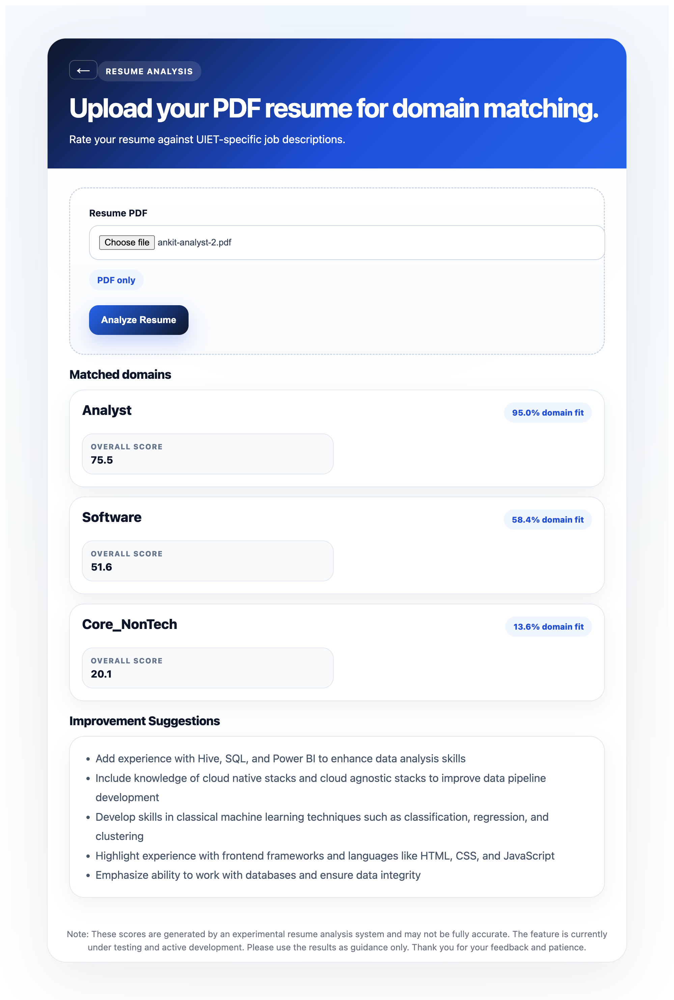

# Campus-Specific ATS Backend

A GenAI-powered Resume ATS Analyzer that evaluates resumes against a **curated collection of job descriptions** rather than a single job description or all available jobs. It uses Retrieval-Augmented Generation (RAG), semantic search, and LLMs to provide ATS scores, identify skill gaps, and generate personalized resume improvement suggestions.



## Why Campus-Specific ATS?

Traditional ATS analyzers compare a resume against:

- A single user-provided Job Description, or
- A generic collection of jobs from across the internet.

This system follows a different approach.

The objective is to evaluate resumes against a **specific, curated set of job descriptions** chosen by an organization, institution, or placement cell. For example, a college can upload all placement job descriptions collected over the past 3–4 years, enabling students to understand how well their resumes align with actual campus recruitment opportunities.

---

# System Architecture

## 1. Job Description Ingestion Pipeline

When a ZIP file containing Job Descriptions is uploaded:

1. Text is extracted from PDF and DOCX files.
2. The extracted content is cleaned and normalized.
3. Embedding vectors are generated using Sentence Transformers.
4. The system predicts the career domain (e.g., Software, Analyst, Core_NonTech) along with a confidence score.
5. The following information is stored in the PostgreSQL (NeonDB) knowledge base:
   - File name
   - Raw text
   - Cleaned text
   - Embedding vector
   - Domain classification metadata

---

## 2. Global Retrieval Strategy

When a candidate uploads a resume:

1. The resume text is converted into an embedding vector.
2. A single semantic retrieval operation is executed against all stored Job Descriptions.
3. Cosine similarity is computed between the resume embedding and every JD embedding.
4. The system retrieves the **Top 50 most relevant Job Descriptions** using `retrieve_top_jds_global()`.

This Top 50 subset is cached and shared across two downstream pipelines:
- ATS Scoring Pipeline
- RAG Suggestion Pipeline

This design eliminates redundant retrieval operations, reduces computational overhead, and ensures ATS scoring and AI suggestions are based on the exact same retrieval context.

---

## 3. Branch A: ATS Scoring & Domain Fit Module (Top 50 JDs)

The retrieved Top 50 Job Descriptions are grouped by career domain. For each domain, the system computes an ATS score using three independent signals based on the following execution flow:

### ATS Scoring Flow
1. The resume is compared against **all job descriptions** using semantic similarity.
2. A semantic similarity (retrieval) score is computed for each job description.
3. All job descriptions are ranked in descending order of their similarity scores.
4. The **top 50 most relevant job descriptions** are retrieved.
5. The ATS scoring module evaluates the resume against these **top 50 job descriptions**.
6. The final ATS score, skill match, keyword match, and other analysis are generated based on these top 50 job descriptions.

### Scoring Metrics & Signal Breakdown

*   **Semantic Similarity:** Measures how closely the resume aligns with the overall content of a Job Description using embedding similarity.
*   **Skill Overlap:** Checks whether domain-specific technical skills from the Job Descriptions are present in the resume.
*   **Keyword Coverage:** Measures how many critical keywords and contextual terms from the Job Descriptions appear in the resume.

### ATS Score Formula

$$\text{ATS Score} = (\text{W}_1 \times \text{Semantic Similarity}) + (\text{W}_2 \times \text{Skill Overlap}) + (\text{W}_3 \times \text{Keyword Coverage})$$

### Domain Fit Analysis

The system also calculates a Domain Fit score that estimates how strongly the resume aligns with each career category.

Example:
- Analyst: 99.6%
- Software: 74.0%
- Core: 7.2%

### Overall Recommendation Formula

$$\text{Overall Score} = (\text{W}_{Fit} \times \text{Domain Fit}) + (\text{W}_{ATS} \times \text{Average ATS Score})$$

The domain with the highest overall score is recommended as the candidate's strongest placement category.

---

## 4. Branch B: RAG Pipeline & AI Suggestions (Top 3 JDs)

Passing all Top 50 Job Descriptions into an LLM would increase prompt size and introduce unnecessary noise. To maintain relevance and reduce hallucinations, the system runs a specialized prompt generation workflow:

### RAG Resume Suggestion Flow
1. The resume is compared against **all job descriptions** using the same semantic retrieval pipeline.
2. A semantic similarity (retrieval) score is computed for each job description.
3. All job descriptions are ranked in descending order of their similarity scores.
4. The **top 3 most relevant job descriptions** are retrieved (`RAG_TOP_K = 3`).
5. These top 3 job descriptions are converted into a textual context block using `build_rag_context()`.
6. The raw resume and the context from these 3 job descriptions are packaged into a prompt sent to a Groq-hosted LLM.
7. The LLM operates as a strict Retrieval-Augmented Generation (RAG) system and generates up to 5 personalized resume improvement suggestions in JSON format.

The structured response highlights:
- Missing skills
- Resume improvement suggestions
- Formatting recommendations
- Project enhancement ideas
- Keyword optimization guidance

This ensures recommendations remain grounded in real recruitment requirements rather than generic advice.

---

# Tech Stack

| Component | Technology |
|---|---|
| **Backend Framework** | FastAPI (Python) |
| **Vector & Metadata Database** | PostgreSQL (NeonDB) |
| **Embedding Engine** | Sentence Transformers (`all-MiniLM-L6-v2`) |
| **Inference Orchestration** | Transformers + Groq Cloud SDK |
| **Containerization** | Docker |

---

## Tech Stack

* **Backend Framework:** FastAPI (Python)
* **Vector & Metadata Database:** PostgreSQL (NeonDB)
* **Embedding Engine:** Sentence Transformers (`all-MiniLM-L6-v2`)
* **Inference Orchestration:** Transformers & Groq Cloud SDK
* **Containerization:** Docker

---

# Getting Started

### Environment Variables
Create a `.env` file in the project root directory:

```env
DATABASE_URL=your_neondb_connection_string
PYTHONUNBUFFERED=1
ALLOWED_ORIGINS=*
GROQ_API_KEY=your_groq_api_key
```

## Installation

## Clone the Repository

```bash
git clone https://github.com/rajeraankit4/resume-ats-fastapi.git
cd resume-ats-fastapi
```

## Create a Virtual Environment

```bash
python -m venv venv
```

## Activate the Environment

### Windows

```bash
venv\Scripts\activate
```

### Linux/macOS

```bash
source venv/bin/activate
```

## Install Dependencies

```bash
# Install CPU version of PyTorch
pip install --index-url https://download.pytorch.org/whl/cpu torch

# Install project dependencies
pip install -r requirements.txt
```

---

# Running the Project Locally

Start the FastAPI development server:

```bash
uvicorn app:app --host 0.0.0.0 --port 10000
```

The application will be available at:

* **API Base URL:** `http://localhost:10000`
* **Swagger UI:** `http://localhost:10000/docs`

---

# Running with Docker

## Build the Docker Image

```bash
docker build -t resume-ats .
```

## Run the Container

```bash
docker run -d \
  --name resume-ats \
  -p 10000:10000 \
  --env-file .env \
  resume-ats
```

---

# API Endpoints

## 1. Bulk Upload JDs

**Endpoint**

```http
POST /jds/upload-zip
```

**Description**

Uploads a ZIP file containing multiple Job Descriptions (PDF/DOCX), parses the files, classifies their domains, generates embeddings, and stores them in the database.

---

## 2. Match Resume

**Endpoint**

```http
POST /match/all-domains
```

**Description**

Accepts a resume file, runs the complete evaluation pipeline, and returns domain-wise ATS scores, domain fit metrics, and AI-generated resume improvement suggestions.

### Sample Response

```json
{
  "domain_scores": {
    "Analyst": {
      "ats_score": 88.5,
      "domain_fit": 99.6,
      "overall_score": 94.05
    }
  },
  "suggestions": [
    "Add AWS experience.",
    "Highlight machine learning projects.",
    "Include Docker and containerization skills.",
    "Quantify project achievements with metrics."
  ]
}
```
